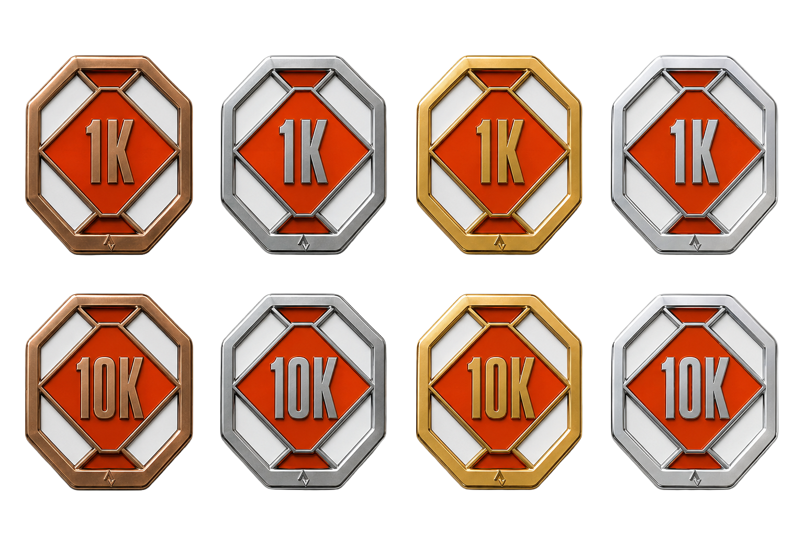
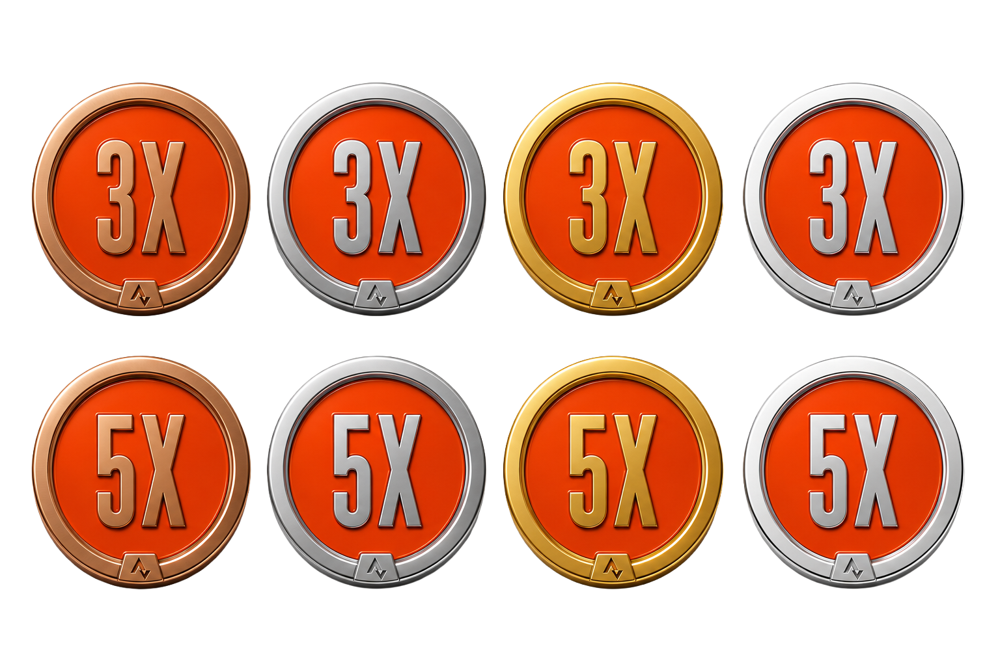

# Guild Enamel

Metal-and-enamel achievement badges—achievement badges, distance milestones, streak chips, and limited editions—with locked construction rules so every badge looks like it belongs to the same family.

**Primary usage:** run the CLI from the repo root (see [root README](../README.md)):

```bash
pnpm generate "50K ultra"
```

<p align="center">
  
  
  
</p>

## What’s in this folder

- **`SKILL.md`**—locked construction rules (material, lighting, color logic) and the router the CLI ports into TypeScript.
- **`prompt-library.md`**—fully spelled-out prompt text for each family (backup wording; the CLI uses the shorter assembly template).
- **`references/`**—style anchors sent to multimodal image models.
- **`assets/logo-mark.png`**—example logo used when `brand.config.json` points at it.

## Re-skinning for a different brand

Edit root [`brand.config.json`](../brand.config.json) (hex colors + `logoPath`), or pass `--logo` / `--primary` / `--accent1` / `--accent2` on a single run.

## Legacy: ChatGPT Project

You can still paste `SKILL.md` into a ChatGPT Project, upload `prompt-library.md` + `references/` as Sources, and attach your logo on each message. Prefer the local CLI for model comparison via AI Gateway.

## License

The workflow, instructions, and prompt text here are [MIT-licensed](../LICENSE). Example images in `references/` and `assets/` are not—see [IP-NOTICE.md](IP-NOTICE.md).

---

Made by [Chip](https://madebychip.com)
